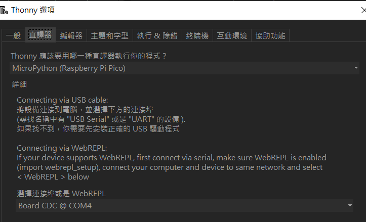
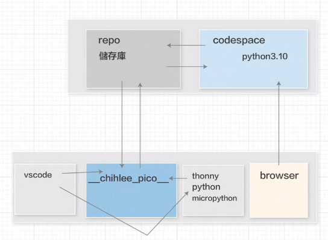

# Yovela_pico_w

# google meeting 
 https://meet.google.com/rgg-rywi-hbw

 # python 說明文件
 https://docs.python.org/zh-tw/3.10/contents.html

 # git指令
 git push --force (已這台的code為基準)
 git config --global --add pull.rebase true

 # python套件安裝
 pip install --upgrade pip 
 pip install PyInputPlus (https://pypi.org/project/PyInputPlus/)

 # 其他
 help(套件名稱)  可查詢套件使用教學

 # 下載Github desktop & Thonny

## Thonny設定pico直議器方式

# 上課架構圖

 https://www.raspberrypi.com/documentation/microcontrollers/images/picow-pinout.svg

#LED燈接法

LINE NOTIFY 權杖
vF4KX3t8lCjPqWXChUdhMKJh8uIx741yfyhCeEzW5Zd
